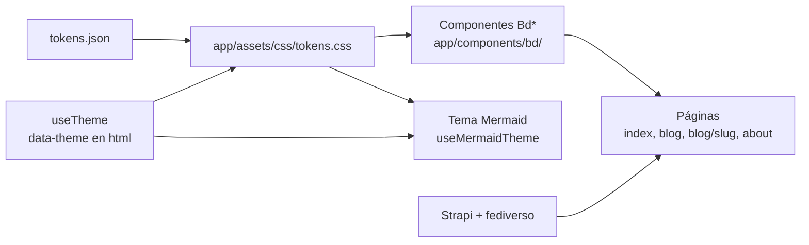
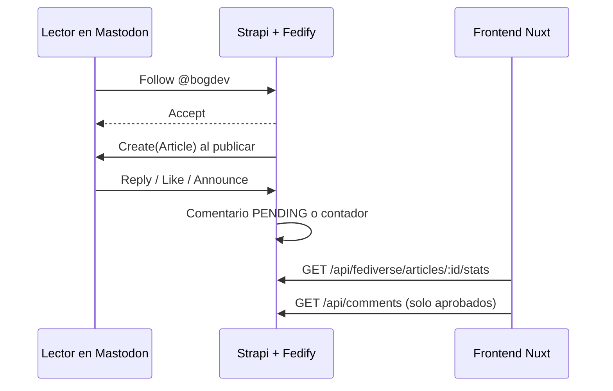
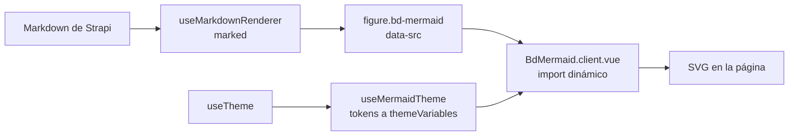
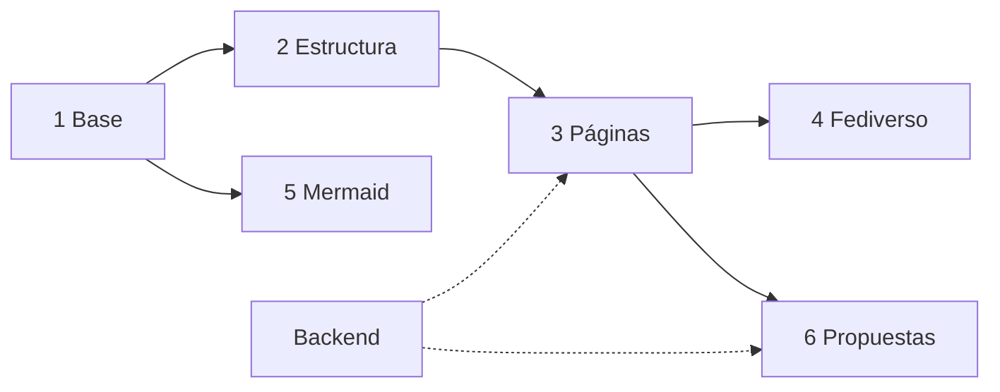

# BogDev — especificación de implementación del rediseño

> Rediseño «noche de páramo, aves de la sabana». Este archivo es la fuente de verdad para los agentes que implementan los issues etiquetados `rediseño`. Si un issue y este archivo difieren, manda el issue más reciente; si el lienzo y este archivo difieren en medidas u orden, manda el lienzo (`reference/canvas/`).

## 0. Cómo usar esta carpeta

| Archivo | Qué es | Cómo se usa |
| --- | --- | --- |
| `DESIGN.md` | Esta especificación | Leer completa la sección que cita tu issue, más las secciones 1 y 3 |
| `tokens.json` | Tokens del sistema de diseño (colores por tema, tipo, espacio, radios, sombras) | Única fuente de valores. Nunca escribir un hex a mano |
| `tokens.css` | Variables CSS generadas desde `tokens.json` | Referencia; el issue de tokens lo genera en `app/assets/css/tokens.css` |
| `build-tokens.mjs` | Generador de `tokens.css` | Se mueve a `scripts/build-tokens.mjs` |
| `reference/canvas/*.dc.html` | Fuente HTML de cada pantalla del lienzo de diseño | Leer como especificación: estilos en línea = medidas, textos literales = copy final. **No copiar el markup**: es un prototipo con plantillas `{{…}}`, `<sc-if>`, `<sc-for>` y `<dc-import>` |
| `reference/canvas/bogdev-site.css` | Hoja compartida del lienzo (bandada, parallax, teleférico, hoja inferior, acordeones, etc.) | Referencia de animaciones y keyframes |
| `reference/ds/bundle.js`, `bundle.css`, `index.d.ts.txt` | Componentes React del sistema de diseño | Referencia de props, clases `bd-*` y comportamiento para portarlos a Vue |

Pantallas del lienzo:

| Archivo | Pantalla |
| --- | --- |
| `Main.dc.html` | Inicio · escritorio (1440 px) |
| `Articulo.dc.html` | Artículo · escritorio |
| `Blog.dc.html` | Blog · escritorio |
| `Acerca.dc.html` | Acerca de · escritorio |
| `Movil.dc.html` | Inicio · móvil (390 px) |
| `BlogMovil.dc.html` | Blog · móvil |
| `AcercaMovil.dc.html` | Acerca de · móvil |
| `Header.dc.html` | Header · componente compartido (props `movil`, `activa`, `lectura`, `progreso`, `seccion`) |
| `Footer.dc.html` | Footer · componente compartido (prop `movil`) |

> Nota: las pantallas anteriores a esta versión muestran algunos textos de ejemplo entre corchetes (`[N]`, `[AQUÍ PUEDE IR TU FOTO]`). Son marcadores: el dato real sale de la API.

## 1. Resumen y convenciones

Cada requisito lleva un estado: **EXISTE** (ya está en producción, solo cambia la presentación), **NUEVO** (funcionalidad nueva) o **PROPUESTA APROBADA** (idea marcada ▲ en el lienzo; todas fueron aprobadas por Alejandro el 2026-09-24 y se construyen en la fase 6).

| Fuente | Qué contiene |
| --- | --- |
| Lienzo de diseño | 9 pantallas: Inicio, Artículo, Blog y Acerca de (escritorio), Inicio, Blog y Acerca de (móvil), Header y Footer compartidos |
| Sistema de diseño BogDev | Tokens y 8 componentes React (Logo, Button, CategoryTag, NavBar, PostCard, NewsletterForm, CodeBlock, Callout); logos oficiales |
| Frontend `ale9420/devbog-blog-front` | Nuxt 4, Vue 3, Nuxt UI, Tailwind 4, i18n es/en, Vitest, Playwright |
| Backend `ale9420/devbog-blog-backend` | Strapi 5, plugin de comentarios, plugin de fediverso (Fedify), `docs/FEDIVERSE.md` |

Convenciones para agentes:

- Seguir `AGENTS.md` del repo (script setup ordenado, tipos explícitos, sin comentarios, i18n para todo texto visible).
- Los componentes del sistema de diseño están en React; el frontend es Vue. Se portan a componentes Vue con el mismo nombre (`Bd*`), las mismas props y las mismas clases CSS `bd-*`, pero todo identificador va en inglés (ver `AGENTS.md`): si una prop, un evento, un valor o una clase está en español (`activa`, `tema`, `nota`, `blanco`), se traduce. No montar React dentro de Nuxt.
- Colores, tipo y espacio salen de `tokens.json` vía variables CSS. Nunca un hex en un componente.
- Textos: español de Colombia, tuteo, títulos en tipo oración, sin emoji ni signos de exclamación. Glifos permitidos: → ↗ ◆ ▲ ✕ ✓ ·. Cada texto nuevo va en `i18n/locales/es.json` y `en.json`.
- Un issue = un PR pequeño. Si el issue depende de otro abierto, trabajar sobre `main` con lo que exista y dejar la integración detrás de una bandera o un dato opcional; nunca inventar campos de API.

## 2. Estado actual frente al objetivo

| Área | Hoy en producción | Objetivo | Estado |
| --- | --- | --- | --- |
| Tema visual | Tailwind + Nuxt UI, claro/oscuro genérico (`useColorMode`) | Temas Noche y Día · Salmona con tokens BogDev | NUEVO |
| Logo | `public/bogdev.svg` en header y footer | Componente `BdLogo`: color en Día, blanco en Noche | EXISTE (cambia uso) |
| Categorías | IA, Software, Linux | + Privacidad y DIY como pilares, cada una con su ave | NUEVO (requiere backend) |
| Header | `LayoutHeader` + `MobileMenu` lateral | `BdHeader` compartido (escritorio, móvil, lectura) + tab bar + hoja inferior | NUEVO |
| Inicio | Hero, destacado, últimos, newsletter | Hero con bandada, guía de campo, sección fediverso | NUEVO |
| Blog | Filtro por categoría y etiqueta, paginación de 6, barra lateral | Rediseño + bitácora, orden, ruta de lectura, marca leído, RSS por categoría | EXISTE + PROPUESTA APROBADA |
| Artículo | TOC, relacionados, Buy Me a Coffee, comentarios, compartir | Barra de lectura con ave, portada con diagrama, barra del fediverso, hilo unificado | EXISTE + NUEVO |
| Acerca de | Single type `about` con bloques | Ficha de campo tipo portafolio | NUEVO (requiere backend) |
| Fediverso | Backend listo (fases 0–4), sin UI | Seguir, contadores, respuestas como comentarios | NUEVO |
| Diagramas Mermaid | Sin soporte | Render con tema Noche/Día | NUEVO |
| Búsqueda | Modal, solo títulos, mínimo 3 letras | Paleta ⌘K + búsqueda en el contenido | EXISTE + PROPUESTA APROBADA |
| Móvil | Menú lateral | Barra superior, tab bar inferior y menú en hoja inferior | NUEVO |

## 3. Fundamentos visuales

Todo color sale de variables CSS con el nombre del token. El tema se aplica con `data-theme="noche"` o `data-theme="dia"` en `<html>`. Noche es el tema por defecto; sin preferencia guardada se respeta `prefers-color-scheme`.

### Colores por tema

| Token | Noche | Día · Salmona | Uso |
| --- | --- | --- | --- |
| surface | #0a0c10 | #f3e9df | Fondo de página |
| surface-raised | #12151b | #fbf6f0 | Tarjetas, menús, campos |
| surface-sunken | #06070a | #e8d8c8 | Código, imágenes vacías, diagramas |
| line / line-strong | #262a33 / #6c7380 | #dccab9 / #8f6f5d | Hairlines / borde de controles |
| ink / ink-muted | #f2f1ec / #9ba1ac | #2b1a13 / #6a4f42 | Texto |
| mirla | #ff7a1a | #a3410f | Marca, botón accent, Software |
| chillon | #2ee6b6 | #0a6656 | Enlaces, foco, éxito, IA |
| monjita | #ffd21f | #6f5200 | Aviso, Linux |
| pinchaflor | #a08cff | #4f36c2 | Privacidad (solo categoría) |
| golondrina | #5cb8ff | #0b5a9c | DIY (solo categoría) |
| tingua | #ff5a4e | #a21d2c | Solo errores |
| logo-agua / logo-ladrillo | #ffffff / #ffffff | #0D6B6F / #D4743F | Solo el logo |

Cada acento tiene su `*-soft` para fondos detrás de su propio texto. Un solo acento dominante por vista; el color nunca comunica solo (siempre palabra o glifo). Valores completos en `tokens.json`.

Categorías y aves:

| Slug | Nombre | Ave | Token |
| --- | --- | --- | --- |
| privacidad | Privacidad | Pinchaflor (Diglossa cyanea) | pinchaflor |
| diy | DIY · Hazlo tú mismo | Golondrina (Pygochelidon cyanoleuca) | golondrina |
| ia | Inteligencia artificial | Colibrí chillón (Colibri coruscans) | chillon |
| software | Desarrollo de software | Mirla patinaranja (Turdus fuscater) | mirla |
| linux | Linux y código abierto | Monjita bogotana (Chrysomus icterocephalus bogotensis) | monjita |

### Tipografía, espacio y forma

- Archivo variable (ejes `wdth` 62–125 y `wght` 100–900) para todo; títulos grandes con `font-stretch: 125%` (clase `bd-wide`) y peso 300. JetBrains Mono para eyebrow, meta y código.
- Escala: display-xl 72/76, display-l 48/54, heading-1 32/40, heading-2 24/32, heading-3 19/26, body-l 19/32, body 16/26, body-s 14/22, eyebrow 12/16 (mayúsculas, tracking .16em), meta 13/20.
- Espacio base 4 px; secciones separadas 96 px en escritorio y 80 px en móvil; márgenes laterales 120 px (contenedor 1200 px) y 20 px en móvil.
- Esquinas rectas en todo (radio 0; 2 px solo en puntos de categoría; 9999 px solo en el avatar). Sin sombras de elevación: la profundidad es luz (`glow-chillon`, `glow-mirla`), reducida a hairline en Día.

### Movimiento y accesibilidad

- Transiciones de 240 ms con `cubic-bezier(.2, 0, 0, 1)`. Con `prefers-reduced-motion: reduce` no hay ninguna animación (bandada, parallax, banderas LED de Colpatria, barra de lectura, barrido de tema).
- Contraste mínimo 4.5:1 para texto y 3:1 para bordes de controles en ambos temas (verificado en los tokens).
- Foco visible: contorno de 2 px `var(--focus)` con 2 px de separación. Objetivos táctiles de al menos 44 px.

## 4. Arquitectura en el frontend (Nuxt 4)

El rediseño vive en una capa de tokens y componentes `Bd*` sobre la app actual; páginas, rutas, i18n y llamadas a Strapi se conservan.



### Base

- **Tokens.** `scripts/build-tokens.mjs` genera `app/assets/css/tokens.css` desde `tokens.json` (se copian desde esta carpeta). Mapear las variables actuales de `main.css` (`--foreground`, `--primary`, `--muted`, `--border`, `--surface-elevated`…) y la paleta de Nuxt UI a estas variables para no duplicar colores.
- **Tema.** Hoy `useTheme` envuelve `useColorMode` con valores light/dark. Configurar color mode con `dataValue: 'theme'` y mapear `dark → noche`, `light → dia`, o ampliar `useTheme` para exponer `tema: 'noche' | 'dia'`, `setTema()`, `toggle()`. La preferencia persiste y se aplica antes del primer pintado (sin parpadeo).
- **Cambio de tema con View Transitions.** `document.startViewTransition` con barrido circular desde el botón (`--vt-x`, `--vt-y`; keyframe `bd-wipe` en `bogdev-site.css`). Sin soporte o con movimiento reducido, cambio directo.
- **Fuentes.** Archivo (ejes wdth, wght) y JetBrains Mono autoalojadas en `public/fonts/` (preferible por privacidad) con `font-display: swap`.
- **Componentes** Vue en `app/components/bd/`: `BdLogo`, `BdButton`, `BdCategoryTag`, `BdNavBar`, `BdHeader`, `BdPostCard`, `BdNewsletterForm`, `BdCodeBlock`, `BdCallout`, `BdFooter`, `BdMermaid`. Props iguales a `reference/ds/index.d.ts.txt`.
- **Logo.** `BdLogo` dibuja los trazos exactos de `public/bogdev.svg` (ver `LOGO` en `reference/ds/bundle.js`, `viewBox="10 70 506 386"`) con `fill: var(--logo-agua)` y `var(--logo-ladrillo)`; props `size`, `variant` (`auto | color | blanco | negro`) y `wordmark`.

### CSS moderno requerido

| Técnica | Dónde | Respaldo sin soporte |
| --- | --- | --- |
| View Transitions API | Cambio de tema y navegación (`experimental.viewTransition`) | Cambio instantáneo |
| Scroll-driven animations (`view()`, `scroll()`) | Revelado de secciones, barra de lectura, parallax del footer | Sin animación, estado final visible |
| CSS Motion Path + animación de `d` | Bandada del hero | Aves estáticas u ocultas |
| Container queries | `BdNewsletterForm` apila campo y botón por debajo de 440 px | — |
| `color-mix()` | Capas de los cerros del footer | Colores fijos por tema |
| Fuente variable (`font-stretch`) | Hover de títulos y marca | Sin cambio |
| `text-wrap: balance / pretty` | Títulos y párrafos | Ajuste normal |

Todas las animaciones de scroll van dentro de `@supports (animation-timeline: view())`.

## 5. Especificación por página

### 5.1 Header compartido (`Header.dc.html`)

Un solo componente `BdHeader` en `layouts/default.vue`, reemplaza `LayoutHeader`, `LayoutMobileMenu` y `LayoutReadingProgress`. Props:

| Prop | Tipo | Uso |
| --- | --- | --- |
| `activa` | `'inicio' \| 'blog' \| 'acerca'` | Marca el enlace actual (`aria-current="page"`, subrayado mirla). Derivar de la ruta |
| `lectura` | `boolean` | En `/blog/[slug]` cambia la franja HUD por la franja de lectura |
| `seccion` | `string` | Categoría del artículo en las migas |

Eventos: `search` (abre la paleta ⌘K), `menu` (abre la hoja inferior en móvil). Tema e idioma los resuelve el propio header con `useTheme` y `useI18n`.

- **Escritorio** (≥ 768 px): `BdNavBar` de 72 px (logo 30 px + «BogDev», Inicio · Blog · Acerca de, selector ES/EN) y debajo una franja de 64 px:
  - Variante sitio: `◆ BOGOTÁ 4.61°N 74.08°W 2.640 M S.N.M.` a la izquierda; chip `◆ @bogdev` (enlace a la sección fediverso del inicio), botón `Buscar ⌘K` y segmento `Noche | Día` a la derecha.
  - Variante lectura: barra de progreso de 2 px en chillon con un ave aleteando en la punta (`animation-timeline: scroll(root)`), migas `INICIO / BLOG / <categoría>`, `LEÍDO N %` y segmento `Noche | Día`.
- **Móvil** (< 768 px): barra de 64 px fija con `position: sticky`: logo 28 px + marca, botón Buscar y botón Menú (iconos de trazo, `aria-label`).
- **Tab bar inferior** (móvil, parte del layout): fija, 64 px, Inicio · Blog · Buscar · Menú; pestaña activa con borde superior mirla.
- **Hoja inferior** (móvil): `<dialog>` modal con secciones, los 5 temas con su punto de color, tema de color Noche/Día e idioma ES/EN. Esc y deslizar cierran; foco atrapado (`useFocusTrap` ya existe).
- **Paleta de búsqueda** (`SearchModal.vue` rediseñado): resultados de artículos y temas, acciones «Cambiar tema» y «Seguir en el fediverso». Atajo ⌘K / Ctrl+K (`useKeyboardShortcut` ya existe).

### 5.2 Inicio (`Main.dc.html`, `Movil.dc.html`)

- Hero: «Explorando privacidad, DIY, IA, software y Linux.» en display-xl ancho; a la derecha una foto del PNN Sumapaz (laguna y frailejones) en dos versiones etalonadas, una para Noche con luna y otra para Día con niebla, que se funden con el fondo por la izquierda y por arriba. Encima, 3 rutas de vuelo y 9 aves con `offset-path` que aletean animando `d`, y en escritorio la marca «PNN Sumapaz · Frailejones».
- Pie del hero: «Fig. 01 — PNN Sumapaz · Foto: Danielfjio · Wikimedia Commons · CC BY-SA 4.0 · Recortada y etalonada», con enlaces a la foto original y a la licencia. Va en una caja `surface` con borde `line` para que el texto mantenga el contraste sobre la foto. Las versiones recortadas son obra derivada y se publican con la misma licencia (CC BY-SA 4.0).
- Artículo destacado (`BdPostCard featured`).
- Últimos artículos con filtros por categoría (6 chips con contador) y estado vacío con ave posada.
- Guía de campo: Privacidad y DIY como pilares grandes; IA, Software y Linux debajo, cada uno con su ave en línea fina. En móvil, carrusel con scroll-snap.
- Sección Fediverso (sección 6) y Newsletter + bloque RSS.

### 5.3 Blog (`Blog.dc.html`, `BlogMovil.dc.html`)

- EXISTE: buscador (títulos, mínimo 3 letras), filtros por categoría y etiqueta, chips de filtros activos con ✕ y «Limpiar filtros», 6 por página, recientes, RSS completo.
- Escritorio: rejilla de 2 columnas + barra lateral de 3 columnas. Móvil: una columna y la barra lateral al final.
- PROPUESTAS APROBADAS: sección 8. Quitar la etiqueta «▲ Propuesta · no implementado», el borde punteado y el banner de propuestas del lienzo: en producción son funciones normales.

### 5.4 Artículo (`Articulo.dc.html`)

- Header en variante lectura (5.1).
- Cabecera: categoría, fecha, título display-l, extracto, autor, compartir (Copiar enlace, Mastodon ↗).
- Portada: imagen 16:9; sin imagen, campo `surface-sunken` con scanlines. Los diagramas de portada usan Mermaid (sección 7).
- Cuerpo: TOC fijo a la izquierda con sección activa, texto de 68ch, `BdCallout`, `BdCodeBlock`.
- Tras el cuerpo, en este orden (como hoy en `[slug].vue`): etiquetas, tarjeta de autor, Buy Me a Coffee (pocillo de tinto animado, botón primario a `https://www.buymeacoffee.com/ale9420`), conversación (comentarios + fediverso), relacionados + newsletter.

### 5.5 Acerca de (`Acerca.dc.html`, `AcercaMovil.dc.html`)

Ficha de campo: «Hola, soy Alejandro.», datos (nombre, hábitat, especialidad, canto = handle del fediverso), lámina con el copetón (espacio para foto), quién escribe, cinco temas con aves, proyectos (fediverso destacado, frontend, sistema de diseño), cinco principios, open source, cómo moverte, redes. Todo el texto sale del single type `about` de Strapi con los componentes nuevos del backend.

### 5.6 Footer compartido (`Footer.dc.html`)

- Un solo `BdFooter` en `layouts/default.vue`; variante móvil por breakpoint (< 768 px).
- Contenido: logo + marca, tagline, redes (LinkedIn, GitHub, Codeberg, Mastodon con `rel="me"`), Navegar, Temas (5 con punto de color), Suscribirse (RSS, Newsletter, Fediverso, Invitarme un café), panorama de los cerros orientales y créditos.
- Panorama en capas SVG: páramo, cerros con Monserrate (3.152 m, basílica) y Guadalupe (3.317 m, santuario y Virgen), faldas, copetón (`public/copeton.png`) al 30–45 % de opacidad a la izquierda y skyline de occidente a oriente (Torre Atrio Norte, CCI, Hotel Tequendama, BD Bacatá, Avianca, Colpatria, Torres del Parque, La Santamaría). En Noche, la fachada LED de Colpatria rota las banderas de Palestina, Colombia y Bogotá cada 18 s. En Día sin luces ni LED.
- Parallax: `animation-range: entry 0% entry 100%` para que la posición final sea igual en todas las páginas.
- Móvil: redes en rejilla de 4, grupos plegables con `<details>`, panorama deslizable de 1152 × 352 px.
- Recursos: extraer los SVG del panorama de `Footer.dc.html` a `app/assets/footer/` o a un componente `BdPanorama.vue`.

## 6. Fediverso

El backend federa el blog como `@bogdev@api.bogdev.com.co` (fases 0–4 verificadas; ver `docs/FEDIVERSE.md` del backend). El frontend solo lee.



| Elemento de UI | Dato o acción | Estado |
| --- | --- | --- |
| Tarjeta «anillo de identificación» (Inicio, Acerca de, móvil) | Handle fijo + botón Copiar | NUEVO |
| «Seguir desde tu instancia» | Campo de instancia; abre `https://<instancia>/authorize_interaction?uri=@bogdev@api.bogdev.com.co` (convención de Mastodon); validar que la instancia sea un dominio | NUEVO |
| Barra «En el fediverso» del artículo | `GET /api/fediverse/articles/:documentId/stats` → `{ likes, boosts }`; 404 o error = ocultar la barra | NUEVO |
| «Responder desde el fediverso» | Muestra y copia `https://api.bogdev.com.co/fediverse/articles/:documentId`; abre `authorize_interaction` con esa URL | NUEVO |
| Etiqueta ◆ FEDIVERSO en comentarios | Campo `fediverseActorHandle`; enlace a la nota original con `fediverseUri` | NUEVO |
| Filtro Todos / Del blog / Del fediverso | Filtrado en cliente por `fediverseActorHandle` | NUEVO |
| Nota de moderación | Texto fijo: se revisan antes de publicarse, editar vuelve a revisión, borrar retira, texto plano | NUEVO |

Reglas:

- Comentarios del fediverso: renderizar como texto (nunca `v-html`). El backend ya oculta PENDING/REJECTED.
- Contadores: si la petición falla, ocultar la barra; nunca mostrar «0» por error.
- Solo se federa el idioma por defecto (`FRONTEND_DEFAULT_LOCALE` del backend).
- Fuera de alcance del backend hoy: respuestas del blog hacia Mastodon, handle en `bogdev.com.co`, relays. No diseñar UI que las prometa.

## 7. Diagramas Mermaid con tema Noche y Día

Hoy un bloque ` ```mermaid ` sale como código. Objetivo: dibujarlo en el cliente con los colores del tema activo y volver a dibujarlo al cambiar de tema, sin tocar el contenido en Strapi.



- **Detección.** En `useMarkdownRenderer`, renderer de `code` para `lang === 'mermaid'` que emite `<figure class="bd-mermaid" data-src="<código escapado>"><pre>código</pre></figure>`. El `<pre>` es el respaldo sin JavaScript y el texto para lectores de pantalla. Añadir `figure` y `data-src` a `sanitizeOptions`.
- **Carga.** `BdMermaid.client.vue` (o plugin cliente) busca `.bd-mermaid` tras montar, importa `mermaid` de forma dinámica solo si hay alguno y dibuja cada uno con `mermaid.render(id, src)`. Dependencia `mermaid` 12.x.
- **Tema.** `mermaid.initialize({ startOnLoad: false, securityLevel: 'strict', theme: 'base', themeVariables })`, con `themeVariables` leídas de las variables CSS (`getComputedStyle`), no escritas a mano.
- **Cambio de tema.** Observar `data-theme` en `<html>`; al cambiar, volver a `initialize` y redibujar desde `data-src`.
- **Presentación.** Figura sobre `surface-sunken`, borde `line`, padding 24 px, scroll horizontal si es ancho, pie opcional en estilo meta («FIG. 01 — …»).
- **Accesibilidad.** `role="img"` y `aria-label` desde `accTitle`/`accDescr` o, si faltan, la primera línea.

| Variable de Mermaid | Token |
| --- | --- |
| background | surface-sunken |
| primaryColor, mainBkg, nodeBkg, actorBkg | surface-raised |
| primaryTextColor, textColor, signalTextColor | ink |
| primaryBorderColor, nodeBorder, actorBorder | line-strong |
| lineColor, signalColor | chillon |
| secondaryColor, tertiaryColor | surface |
| clusterBkg / clusterBorder | surface / line |
| noteBkgColor / noteTextColor | monjita-soft / ink |
| errorBkgColor / errorTextColor | tingua-soft / tingua |
| fontFamily / fontSize | font-mono / 13px |

Otras reglas: esquinas rectas, trazos de 1.4 px, un solo acento (chillon) salvo diagramas por categoría (color del ave). `logo-*` nunca se usa en diagramas. Caso de aceptación: el diagrama de portada del artículo de RAG (pregunta → recuperación en el corpus → aumento → generación) escrito como Mermaid se ve igual al del lienzo en ambos temas.

## 8. Propuestas aprobadas (fase 6)

| Propuesta | Qué hace | Dependencia |
| --- | --- | --- |
| Vista Bitácora | Lista cronológica agrupada por mes, con contadores del fediverso | Solo frontend |
| Ordenar | Más recientes, más antiguos, más comentados en el fediverso | Contadores ordenables en el backend |
| Búsqueda en el contenido | Además del título, buscar en el cuerpo | Campo de texto plano en el backend |
| Ruta de lectura por categoría | Lista ordenada con progreso «N de M leídos» | Orden editorial en el backend; progreso en `localStorage` |
| Marca «✓ Leído» | Artículos ya abiertos | `localStorage`, sin datos personales en el servidor |
| RSS por categoría | `/feed/<categoria>.xml` | Ampliar `server/routes/feed.xml.ts` |

## 9. Fases



1. Base: tokens y temas, `useTheme` con View Transitions, fuentes, `BdLogo`, `BdButton`, `BdCategoryTag`, `BdCallout`, `BdCodeBlock`, categorías Privacidad y DIY.
2. Estructura: `BdHeader` + navegación móvil, paleta de búsqueda, `BdFooter` con panorama.
3. Páginas: Inicio, Blog, Artículo (incluye Buy Me a Coffee), Acerca de.
4. Fediverso: anillo y seguir remoto, barra de contadores, hilo unificado.
5. Mermaid.
6. Propuestas aprobadas, una por PR.

## 10. Criterios de aceptación y pruebas

Un issue está terminado cuando pasan `npm run lint`, `npm run typecheck`, `npm test`, `npm run test:e2e` (con las pruebas nuevas de su sección) en ambos temas y a 390 px y 1440 px.

| Qué | Cómo se prueba |
| --- | --- |
| Temas | Playwright: captura de cada página con `data-theme` noche y dia; sin parpadeo al cargar con tema guardado |
| Contraste | axe-core en Playwright: 0 errores de contraste en ambos temas |
| Movimiento reducido | `reducedMotion: 'reduce'`: ninguna animación activa |
| Teclado | Tab recorre navegación, filtros, formularios y hoja inferior; Esc cierra búsqueda y menú; foco visible |
| Footer | Misma captura del footer en Inicio, Blog, Artículo y Acerca de al llegar al final |
| Newsletter móvil | A 350 px, campo y botón de 56 px apilados, sin desbordar |
| Mermaid | Artículo de prueba con `flowchart` y `sequenceDiagram` se dibuja, cambia de colores al alternar tema y muestra el `<pre>` sin JavaScript |
| Fediverso | Con `e2e/mock-strapi.mjs` y `test/integration/mock-strapi.ts`: barra oculta si stats da 404; comentario con `fediverseActorHandle` muestra la etiqueta; texto sin HTML |
| Logo | Color en Día, blanco en Noche; trazos idénticos a `public/bogdev.svg` |

Checklist de cada PR:

- [ ] Usa tokens, no colores escritos a mano
- [ ] Funciona en Noche y Día · Salmona
- [ ] Respeta `prefers-reduced-motion`
- [ ] Textos en `i18n/locales/es.json` y `en.json`
- [ ] Capturas de 390 px y 1440 px en ambos temas en la descripción del PR
- [ ] `Closes #<issue>` en la descripción
